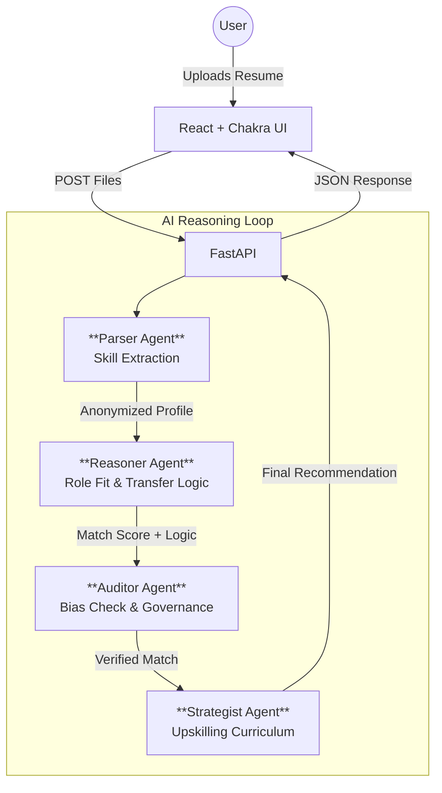

# LucidMatch

> **The Dynamic Skill-Graph Agent** — Moving HR from "Black Box" keyword matching to "Glass Box" reasoning.

LucidMatch is an AI-powered recruitment engine that understands the *logic* of skills. It uses a multi-agent system to identify transferable potential, ensuring that a nurse's crisis management skills or a self-taught developer's portfolio are recognized as valuable assets for relevant roles, rather than being filtered out by rigid keyword searches.


---

## Architecture

LucidMatch employs a **Multi-Agent Architecture** where four specialized AI agents collaborate to process, match, and audit candidate profiles.



### The Agents
1.  **Parser Agent**: Extracts and clusters skills (e.g., grouping "Python" and "SQL" under "Data Analysis"). **Crucially**, it strips PII (names, gender, age) to ensure blind evaluation.
2.  **Reasoner Agent**: Calculates "Transfer Efficiency" scores. It answers: *How efficiently does Skill A transfer to Job Requirement B?*
3.  **Auditor Agent**: The supervisor. It checks for socioeconomic proxies (e.g., expensive hobbies) and enforces demographic parity rules.
4.  **Strategist Agent**: Suggests "Bridge Skills"—specific, learnable topics to close the gap between a candidate and a role.

---

## Tech Stack

### Backend
-   **Framework**: [FastAPI](https://fastapi.tiangolo.com/) (Python 3.9+)
-   **AI**: OpenAI GPT-4o / Anthropic Claude 3.5 Sonnet
-   **Validation**: Pydantic

### Frontend
-   **Framework**: [React](https://react.dev/) (Vite)
-   **UI Library**: [Chakra UI](https://chakra-ui.com/) (v2.8)
-   **Visualization**: Chart.js / Recharts

### Data & Governance
-   **Data**: JSON-based storage for Hackathon/Prototype phase (SQLite ready).
-   **Governance**: Markdown-based Audit Logs for transparency ("Glass Box").

---

## Project Structure

```bash
LucidMatch/
├── backend/
│   ├── agents/          # The 4 AI Brains (Parser, Reasoner, Auditor, Strategist)
│   ├── main.py          # API Entry Point
│   └── requirements.txt # Python Dependencies
├── frontend/
│   ├── src/
│   │   ├── components/  # React UI Components
│   │   ├── pages/       # Page Layouts
│   ├── vite.config.js   # Vite Config
│   └── package.json     # Node Dependencies
├── tests/
│   └── fixtures/        # "Stress Test" Data (Profiles/Jobs)
└── docs/                # Governance Policies & templates
```

---

## Quick Start

### Prerequisites
-   Node.js 18+
-   Python 3.9+
-   And an API Key (OpenAI or Anthropic)

### Backend Setup
```powershell
# Navigate to backend
cd backend

# Create virtual environment
python -m venv venv
.\venv\Scripts\Activate  # Windows
# source venv/bin/activate # Mac/Linux

# Install dependencies
pip install -r requirements.txt

# Run the server
uvicorn main:app --reload
```
*Server running at: `http://localhost:8000`*

### 3. Frontend Setup
```powershell
# Open a new terminal and navigate to frontend
cd frontend

# Install dependencies
npm install

# Start the dev server
npm run dev
```
*App running at: `http://localhost:5173`*

### 4. Configuration
Create a `.env` file in the root directory:
```env
OPENAI_API_KEY=sk-your-key-here
# or
ANTHROPIC_API_KEY=sk-your-key-here
```

---

## Governance & Ethics

We take AI bias seriously. Our **Auditor Agent** specifically looks for:
*   **Socioeconomic Proxies**: Keywords like "sailing" or specific university names that imply wealth rather than skill.
*   **Gendered Language**: Patterns in resumes that might trigger unconscious bias.

See [Bias Policy](docs/bias_policy.md) for the mathematical rules we enforce (e.g., 4/5ths rule).
See [Audit Log Template](docs/audit_log_template.md) for how we track decisions.

---

## Testing & Validation

We use a set of **5 Stress Test Profiles** (located in `tests/fixtures/profiles.json`) to validate our logic:
1.  **The Pivot**: Nurse -> UX Researcher (Tests high-level transfer logic).
2.  **The Underdog**: Bootcamp Grad -> Dev (Tests portfolio valuation over degrees).
3.  **The Global**: International Title -> Local Role (Tests semantic understanding).
4.  **The Overqualified**: PhD -> Entry Level (Tests "path suggestion" logic).
5.  **The Sparse**: Minimal Info (Tests ambiguity handling).

Run tests with:
```powershell
pytest tests/
```

---

## Roadmap

- [x] **Phase 1: Foundation** (Structure, Base Agents, UI Scaffold)
- [ ] **Phase 2: Reasoning Logic** (Implement `Reasoner` and `Parser` logic)
- [ ] **Phase 3: Governance Layer** (Implement `Auditor` checks)
- [ ] **Phase 4: UI Integration** (Connect React to FastAPI, Visualizations)

## Overview

Traditional HR tools rely on exact keyword matching, missing brilliant candidates whose skills don't match a recruiter's search terms. LucidMatch understands the *logic* behind skills—recognizing that a nurse's decision-making and patient advocacy translate to UX research, or that a bootcamp grad's self-teaching demonstrates capability despite lacking traditional credentials.

### Key Features

- **Intelligent Skill Extraction:** Parses resumes and groups skills into competency clusters
- **Transferable Skill Matching:** Calculates "Transfer Efficiency" between candidate skills and job requirements
- **Bias Detection:** Flags socioeconomic proxies and hidden bias in matching logic
- **Privacy-First:** Anonymizes candidate data before AI reasoning
- **Transparent Governance:** Full audit trail explaining every match decision
- **Smart Upskilling:** Recommends targeted learning paths to close skill gaps

## Tech Stack

- **Backend:** Python + FastAPI
- **Frontend:** React (Vite) + Chakra UI
- **AI Engine:** Claude 3.5 Sonnet / OpenAI GPT-4o
- **Database:** SQLite / JSON (for hackathon phase)
- **Visualization:** Chart.js (Skill Gap Radar Charts)

## Quick Start

### Prerequisites

- Node.js 18+
- Python 3.9+
- OpenAI API key or Anthropic API key

### Installation

1. **Install dependencies:**
   ```powershell
   npm install
   ```

2. **Set up backend:**
   ```powershell
   # Create virtual environment
   python -m venv venv
   .\venv\Scripts\Activate
   
   # Install Python dependencies
   pip install fastapi uvicorn python-multipart
   ```

3. **Create `.env` file** in root directory:
   ```
   ANTHROPIC_API_KEY=your_key_here
   # or
   OPENAI_API_KEY=your_key_here
   ```

### Running the Application

**Backend (from project root):**
```powershell
uvicorn backend.main:app --reload
```

**Frontend (in separate terminal):**
```powershell
npm run dev
```

The application will be available at `http://localhost:5173`

## Project Structure

```
LucidMatch/
├── backend/
│   ├── agents/          # AI agent implementations
│   │   ├── parser.py    # Skill extraction
│   │   ├── reasoner.py  # Role matching & transfer efficiency
│   │   ├── auditor.py   # Bias detection
│   │   └── strategist.py # Upskilling recommendations
│   ├── main.py          # FastAPI application
│   └── requirements.txt
├── frontend/
│   ├── src/
│   │   ├── components/  # React components
│   │   ├── pages/       # Page components
│   │   └── App.jsx
│   └── package.json
├── tests/               # Test cases
└── README.md
```

## Development Roadmap

### Phase 1: Core Logic (Jan-Feb)
- [ ] Skill extractor agent
- [ ] Role matcher with transfer efficiency scoring
- [ ] Test with 5 edge-case profiles

### Phase 2: Governance (Feb)
- [ ] Auditor agent for bias detection
- [ ] Decision logging system
- [ ] Counterfactual testing for fairness

### Phase 3: UI & Integration (Feb)
- [ ] Dashboard with skill gap visualization
- [ ] Upskilling curriculum recommendation
- [ ] Full system integration

### Phase 4: Polish (Feb)
- [ ] Performance optimization
- [ ] Documentation
- [ ] Presentation materials

## The Four AI Agents

### 1. Parser (Skill Extraction Agent)
Reads raw resume text (from PDF or plain text) and performs intelligent skill extraction:
- Identifies technical skills, soft skills, and domain expertise
- Groups related skills into "Competency Clusters" (e.g., "Data Analysis" clusters with SQL, Python, Excel)
- Assigns proficiency levels (Beginner, Intermediate, Advanced, Expert)
- **Privacy-Critical:** Strips names, contact info, dates, and demographic identifiers before downstream processing
- Returns structured JSON output for further processing

**Example Output:**
```json
{
  "competency_clusters": {
    "data_analysis": ["Python", "SQL", "Excel"],
    "project_management": ["Agile", "Jira", "Cross-team collaboration"],
    "communication": ["Technical writing", "Presentation skills"]
  },
  "experience_level": "Intermediate",
  "confidence_score": 0.92
}
```

### 2. Reasoner (Role Matching & Transfer Efficiency)
The core intelligence engine that matches candidates to roles:
- Takes extracted candidate skills and compares against job requirements
- Calculates "Transfer Efficiency" (0-100%) for each skill pair showing how directly applicable one skill is to another
  - Example: Finance Data Analysis → Product Analytics = 85% (high similarity)
- Provides **Match Score** with confidence range (e.g., "78% ±5%")
- Returns detailed reasoning trace explaining *why* a match was made
- Identifies skill gaps with priority levels (Critical, Important, Nice-to-have)

**Confidence Ranges:**
- ±2-5%: High confidence (abundant data about the candidate)
- ±5-10%: Medium confidence (some gaps in candidate info)
- ±10%+: Low confidence (sparse resume or unusual profile)

### 3. Auditor (Bias Detection & Governance)
Quality-assurance agent that reviews all recommendations:
- **Bias Detection:** Flags socioeconomic proxies:
  - Expensive hobbies (Sailing, Lacrosse → potential wealth bias)
  - University prestige (Harvard vs. State School)
  - Geographic location (implies cost of living assumptions)
  - Gender-coded language patterns
- **Counterfactual Testing:** Runs same profile through with different names/backgrounds to verify score consistency
- **Decision Logging:** Creates detailed audit trail explaining every recommendation
- **Fairness Metrics:**
  - Demographic Parity: Do match rates differ by protected characteristics?
  - Equal Opportunity: Do candidates with similar qualifications get similar scores?

### 4. Strategist (Upskilling Curriculum)
Generates personalized learning paths to close identified gaps:
- **Quick Wins:** Skills learnable in 1-2 weeks (get role-ready fast)
  - Example: "Tableau basics in 2 weeks"
- **Core Learning:** Deeper skills requiring 1-2 months
  - Example: "Advanced SQL optimization"
- **Curated Resources:** Links to real courses (Coursera, edX, LinkedIn Learning)
- **Time Estimates:** Includes learning time based on candidate's background
- **Verification:** Prevents hallucinated courses; only recommends real, validated resources

---

## System Architecture

### Request Flow
1. **User uploads resume** → Frontend sends to Parser agent
2. **Parser extracts skills** → Anonymized data forwarded to Reasoner
3. **Reasoner calculates matches** → Results sent to Auditor
4. **Auditor reviews output** → Checks for bias and generates confidence scores
5. **Strategist creates curriculum** → Final recommendations compiled
6. **Governance Panel** → Full audit trail displayed to user

### API Endpoints (FastAPI)

```
POST   /api/analyze       - Submit resume for analysis
GET    /api/match/:id     - Get match results by analysis ID
POST   /api/compare       - Compare candidate to multiple roles
GET    /api/audit/:id     - Retrieve full audit trail
POST   /api/upskill/:id   - Generate learning curriculum
```

---

## Key Use Cases

### The Pivot
A healthcare professional (nurse with 5 years experience) applying to UX Research roles.
- **Traditional matching:** 0% match (exact keywords don't align)
- **LucidMatch:** 72% match
  - Recognizes: High-pressure decision-making, patient advocacy, communication skills
  - Gap identified: User research methodology (3-week crash course)
  - Confidence: 72% ±8% (some specialized domain knowledge needed)

### The Underdog
A bootcamp graduate with no CS degree applying for backend engineer roles.
- **Traditional matching:** Filtered out (no degree requirement)
- **LucidMatch:** 68% match
  - Recognizes: Self-directed learning is predictor of success, portfolio demonstrates capability
  - Gap identified: CS fundamentals, system design (8-week program)
  - Confidence: 68% ±10% (unconventional background adds uncertainty)

### The Overqualified
PhD physicist applying for entry-level data analyst role.
- **Traditional matching:** Rejected (overqualified)
- **LucidMatch:** 89% match with "Path Suggestion"
  - Recognizes: Mathematical foundations exceed requirements
  - Flags: "Consider alternative paths (ML, Research Scientist) where candidate could reach senior level"
  - Suggests: Specialized analytics domain (Financial Modeling, Biotech Analytics)

---

## Configuration & Environment

### .env File Variables
```powershell
# Required: Choose one AI provider
ANTHROPIC_API_KEY=sk-ant-...        # For Claude
OPENAI_API_KEY=sk-...               # For GPT-4o

# Optional: Customize behavior
CONFIDENCE_THRESHOLD=0.65           # Min score to show matches
PRIVACY_MODE=true                   # Enable PII stripping
BIAS_CHECK_ENABLED=true             # Enable auditor checks
CACHE_ENABLED=true                  # Cache LLM responses
```

### Python Backend Setup

Create `backend/requirements.txt`:
```
fastapi==0.104.0
uvicorn==0.24.0
python-multipart==0.0.6
anthropic==0.21.0
python-dotenv==1.0.0
pydantic==2.5.0
```

Install:
```powershell
pip install -r backend/requirements.txt
```

---

## Development Roadmap Details

### Phase 1: Core Logic (Target: Feb 1)
**Validation:** Test against 5 "edge-case" profiles
- **The Pivot:** Nurse → UX Research (high-level transfer test)
- **The Underdog:** Bootcamp grad (unconventional credential test)
- **The Global:** International engineer (regional job title interpretation)
- **The Overqualified:** PhD → Entry-level role (role adjustment logic)
- **The Sparse:** Minimal resume (ambiguity handling)

**Deliverables:**
- Parser agent returns clean JSON from messy resumes
- Reasoner calculates transfer efficiency with ±5% confidence on known transitions
- Test suite validates all 5 profiles

### Phase 2: Governance & Fairness (Target: Feb 10)
- Decision Log translates AI reasoning into plain English for HR managers
- Counterfactual testing: Run profiles with different names/demographics; verify scores stay ±2%
- Bias check: Audit each recommendation for socioeconomic proxies
- Audit trail: Full record of which agent did what and why

### Phase 3: UI & Integration (Target: Feb 14)
- Dashboard with Skill Gap Radar Charts (visual comparison)
- Cost estimator showing per-profile analysis cost ($0.12 estimated)
- Governance Panel toggle to view audit trail
- Curriculum recommendation integration

### Phase 4: Polish & Demo Prep (Target: Feb 16)
- Performance optimization (batch processing, caching)
- Demo scenario: Show successful match AND "safe refusal" (low confidence scenario)
- Presentation deck focusing on "Why keyword matching fails" narrative
- Final documentation and deployment readiness

---

## Testing

### Unit Tests
```powershell
# Run all tests
pytest tests/

# Run specific test file
pytest tests/test_parser.py -v

# Run with coverage
pytest --cov=backend tests/
```

### Test Profiles (Included)
Located in `tests/fixtures/profiles.json` - 5 edge-case personas for validation.

### Manual Testing
1. Upload sample resume via UI
2. Verify anonymization (no names in console logs)
3. Check match scores are in 0-100% range
4. Confirm audit trail explains each match
5. Validate upskilling recommendations are real courses

---

## Performance Considerations

- **LLM Calls:** ~3 API calls per resume (Parser, Reasoner, Auditor)
- **Cost:** ~$0.12 per analysis at GPT-4o rates (~$0.003 per call × 3 + ~$0.03 for extended reasoning)
- **Latency:** 8-12 seconds per analysis (mostly LLM response time)
- **Caching:** Identical resumes cached to reduce costs

---

## Troubleshooting

### Common Issues

**"API Key not found" error**
- Verify `.env` file exists in root directory
- Check key is set correctly (no extra spaces)
- Restart FastAPI server after changing `.env`

**Frontend can't connect to backend**
- Confirm backend is running: `uvicorn backend.main:app --reload`
- Check backend URL in frontend config (default: `http://localhost:8000`)
- Verify CORS is enabled in FastAPI

**Slow analysis times**
- First call is slower (LLM warm-up)
- Check API rate limits with your LLM provider
- Consider caching for identical resumes

---

## Security & Privacy

LucidMatch is designed with security and privacy as core architectural principles.

### IT Security Measures

| Layer | Protection |
|-------|------------|
| **Data at Rest** | AES-256 encryption for all stored data |
| **Data in Transit** | TLS 1.3 for all API communications |
| **Authentication** | JWT tokens with secure session management |
| **API Security** | Rate limiting, input validation, CORS policies |
| **Infrastructure** | Isolated containers, no persistent processing storage |

### AI-Specific Risk Mitigation

| Risk | Mitigation |
|------|------------|
| **Bias in recommendations** | Auditor Agent performs real-time bias checks with fairness scoring |
| **Unexplainable decisions** | Full reasoning trace and evidence citations for every recommendation |
| **Data leakage to AI** | PII stripped before any data reaches AI providers |
| **Model hallucination** | Structured output schema enforcement, resource verification |
| **Prompt injection** | Input sanitization, role-based prompt templates |

### Privacy Safeguards

- **PII Stripping**: Names, emails, phones, addresses removed before AI evaluation
- **Anonymized Processing**: AI agents only see anonymized candidate profiles
- **Data Minimization**: Only job-relevant information extracted
- **Retention Limits**: Configurable data retention policies
- **Candidate Rights**: Support for access, rectification, and deletion requests

### Compliance Alignment

LucidMatch is designed to support compliance with:
- **EEOC Guidelines** (4/5ths rule for adverse impact)
- **NYC Local Law 144** (Bias audits for automated hiring)
- **EU AI Act** (High-risk AI transparency)
- **GDPR Article 22** (Right to explanation)
- **CCPA** (Data access and deletion rights)

See [Privacy Safeguards](docs/privacy_safeguards.md) for detailed documentation.
See [Bias Policy](docs/bias_policy.md) for fairness rules and metrics.

---

## Documentation

| Document | Description |
|----------|-------------|
| [Bias Policy](docs/bias_policy.md) | 4/5ths rule, fairness metrics, bias detection |
| [Audit Log Template](docs/audit_log_template.md) | Decision log structure and format |
| [Privacy Safeguards](docs/privacy_safeguards.md) | PII handling and data protection |
